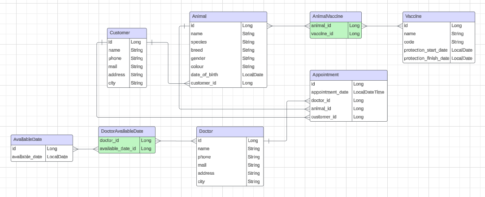

# Veterinary Management System

## Overview

Veterinary Management System is designed using N-tier architecture to streamline the daily operations of a veterinary clinic. It offers comprehensive functionalities to manage animals, appointments, doctors, customers, vaccine and available date.

## Features

- **Animal Management**: Add, update, delete, and search animals.
- **Appointment Management**: Schedule, update, and cancel appointments.
- **Doctor Management**: Manage doctor information and availability.
- **Customer Management**: Add, update, delete, and search customers.
- **Vaccine Management**: Manage vaccine records and schedules.
- **Available Date Management**: Manage available dates for doctors.

## Technologies

- **Backend**: Java, Spring Boot
- **Database**: PostgreSQL, MySQl
- **ORM**: Hibernate
- **Validation**: Jakarta Bean Validation
- **Mapping**: ModelMapper
- **Dependency Management**: Maven

## Getting Started

### Prerequisites

- Java 11 or higher
- Maven 3.6 or higher
- PostgreSQL 12 or higher

## Usage

### Animal Management

| Action                   | Method | Endpoint                        |
|--------------------------|--------|---------------------------------|
| Add Animal               | POST   | `/v1/animals`                   |
| Update Animal            | PUT    | `/v1/animals`                   |
| Delete Animal            | DELETE | `/v1/animals/{id}`              |
| Get Animals by Name      | GET    | `/v1/animals/{name}`            |
| Get Animals by Customer  | GET    | `/v1/animals/customer/{id}`     |

### Appointment Management

| Action                             | Method | Endpoint                                          |
|------------------------------------|--------|---------------------------------------------------|
| Add Appointment                    | POST   | `/v1/appointments`                                |
| Update Appointment                 | PUT    | `/v1/appointments`                                |
| Delete Appointment                 | DELETE | `/v1/appointments/{id}`                           |
| Get Appointments by Doctor and Date Range | GET    | `/v1/appointments/filterByDrDate/{doctorId}`       |
| Get Appointments by Animal and Date Range | GET    | `/v1/appointments/filterByAnmlDate/{animalId}`     |

### Doctor Management

| Action                   | Method | Endpoint                        |
|--------------------------|--------|---------------------------------|
| Add Doctor               | POST   | `/v1/doctors`                   |
| Update Doctor            | PUT    | `/v1/doctors`                   |
| Delete Doctor            | DELETE | `/v1/doctors/{id}`              |
| Get Doctor by ID and Date| GET    | `/v1/doctors/{id}/{date}`       |

### Customer Management

| Action                   | Method | Endpoint                        |
|--------------------------|--------|---------------------------------|
| Add Customer             | POST   | `/v1/customers`                 |
| Update Customer          | PUT    | `/v1/customers`                 |
| Delete Customer          | DELETE | `/v1/customers/{id}`            |
| Get Customers by Name    | GET    | `/v1/customers/{name}`          |

### Vaccine Management

| Action                   | Method | Endpoint                        |
|--------------------------|--------|---------------------------------|
| Add Vaccine              | POST   | `/v1/vaccines`                  |
| Update Vaccine           | PUT    | `/v1/vaccines`                  |
| Delete Vaccine           | DELETE | `/v1/vaccines/{id}`             |
| Get Vaccines by Animal   | GET    | `/v1/vaccines/animal/{id}`      |
| Get Vaccines by Date Range | GET    | `/v1/vaccines/findByDate`       |

### Available Date Management

| Action                   | Method | Endpoint                        |
|--------------------------|--------|---------------------------------|
| Add Available Date       | POST   | `/v1/available-dates`           |
| Update Available Date    | PUT    | `/v1/available-dates`           |
| Delete Available Date    | DELETE | `/v1/available-dates/{id}`      |
| Get Available Dates      | GET    | `/v1/available-dates`           |

## UML Diagram

